# Tune Log

Tune Log is designed to show a discography and a biography of my producer career as dEEGE. Here you will be able to get a sense of my style and where it comes from. You will learn how long I've been doing music and my passion for it, as well as the future of dEEGE. The main target of audience would be artists looking for beats to record vocals on, or other producers for inspiration or potential future collaborations. View the live website [here](https://deege2time.github.io/project1/).

## Table of Contents

1. [Features](#features)
    1. [Discography](#discography)
    2. [Biography](#biography)
    3. [Existing Features](#existing-features)
    4. [Future Features](#future-features)
2. [Technologies](#technologies)
    1. [Languages](#languages)
    2. [Tools](#tools)
3. [Testing](#testing)
    1. [Validation-HTML](#validation-html)
    2. [Validation-CSS](#validation-css)
    3. [Accessibility](#accessibility)
    4. [Performance](#performance)
    5. [Responsive Design](#responsive-design)
    6. [Browser Compatibility](#browser-compatibility)

## Features

### **Features**
 

* Navigation bar
    * Logo also as a link directly to the home page.
    * Links to Overview, Discography and Biography pages.
    * Same features on all three pages, also shows which page is active.
    * Fully responsive on all devices.

* Landing Page
    * Landing page consists of an avatar of dEEGE.
    * Here the user will get some useful information thanks to the "Artist Details" box.
    * With the help of the chosen background image and also the box containing information, the user will immediately know what the website is about.
    * Same features on 2/3 pages (Overview & Discography pages)

* Albums and Singles(Overview) section
    * The website will display clickable images which links to albums and singles that I've collaborated on.
    * Allows the user the first glimpse of my style producing hip-hop.
    * Some minor animations when hovering over image.

 

* Footer
    * Here you will find links to dEEGE's social media and music related websites (Splice & Soundcloud).
    * When hovering over anchors, color change will happen with a slight 0.3s transition.
    * Same features on all three pages.

### **Discography**
 

* Discography Page
    * A showcase of beats to define the style of beats to the user.
    * Here are 6 available beats with controls and no autoplay.

### **Biography**
 

* Biography Page
    * Biography about dEEGE.
    * Contains information about his music and school career.

### **Existing Features**
 

* Responsive design
* 6 beats with controls
* Links to Album / Singles with animation (translateY())
* Links to social media

### **Future Features**
 

* Display album/single name in center when hovering over albums/singles
* Customize controls for .mp3 files.

## Technologies

### **Languages**
 

* HTML
    * Core content and structure written using HTML.

* CSS
    * Styling and responsive design written using CSS.

### **Tools**
 

* Github
    * Source code hosted on github and deployed through github pages.

* Git
    * Commit and pushing code using git

* Cloudconvert
    * Used https://cloudconvert.com/png-to-webp to convert images to webp.

* Tinypng
    * Used https://tinypng.com/ to compress webp images.

* CSS Gradient
    * Used https://cssgradient.io/ to add gradient to background-color.

* Favicon
    * Used https://favicon.io/favicon-generator/ to generate icon in head.

## Testing

### **Validation-HTML**
Used the W3C Markup Validation Service with urls. All pages passed with 0 errors.

Overview

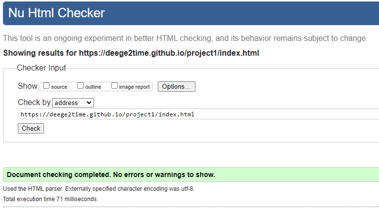

Discography

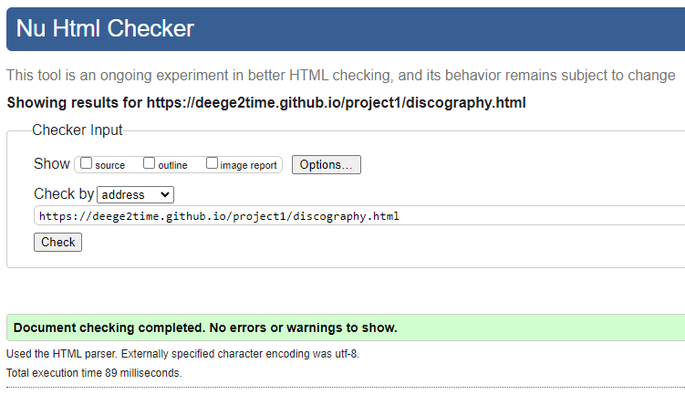

Biography

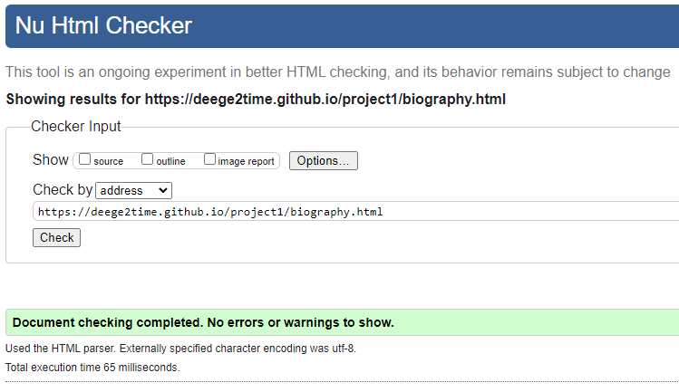

 

### **Validation-CSS**
Used the W3C CSS Validation Service with url and stylesheet. All pages passed with 0 errors.

Whole project

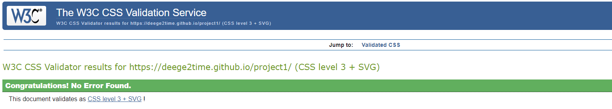

Stylesheet

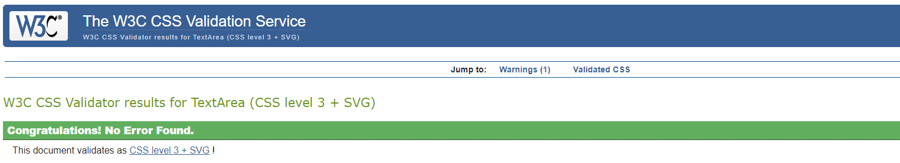

**Warning message: "Imported style sheets are not checked in direct input and file upload modes". From imported fonts** 

 

### **Accessibility**
Ran through WAVE, web accessibility evaluation tool. All pages passed with 0 errors.

Overview

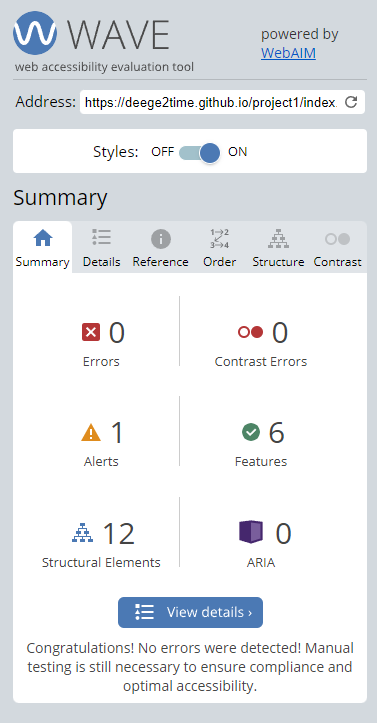

Discography

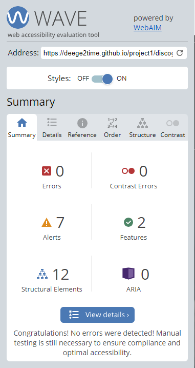

Biography

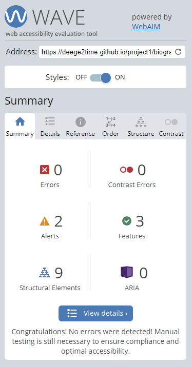

 

### **Performance**
Ran through Google Lighthouse via Google Devtools, only biography scored 99 whilst overview scored 72 and discography scored 75.

Overview

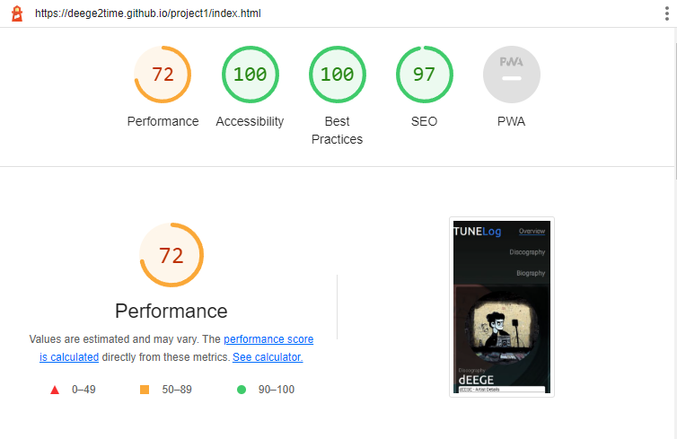

Discography

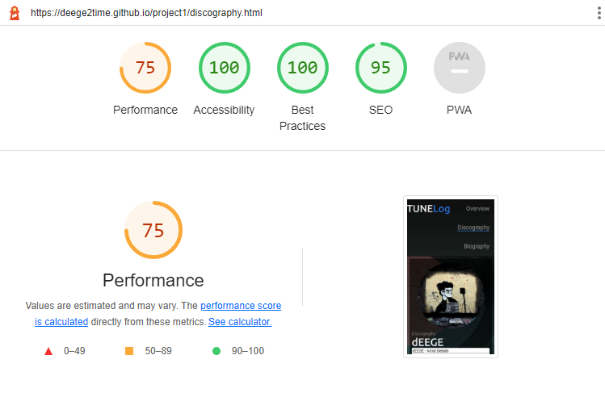

Biography

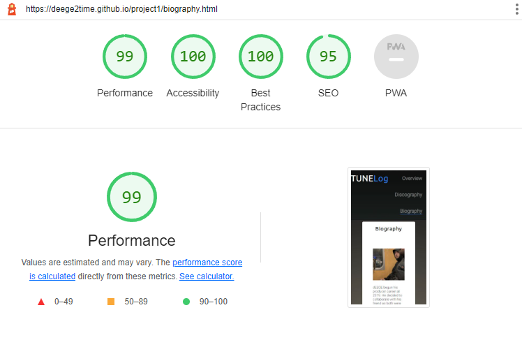

 

### **Responsive Design**
 

Tested for all devices 320px and up.
* Test results from Google Devtools

### **Browser Compatibility**
 

Test from following browsers without problems
* Google Chrome
* Firefox
* Safari (iPhone)

### **Functional Testing**
 

**Basic features displayed through all three pages.**
| **Feature** | **Action** | **Expected Result** | **Actual Result** |
|-------------|------------|---------------------|-------------------|
| Logo | Link to overview | Bring user to overview(home page) | Works as expected |
| Navigation | Navigation for overview, discography, biography| Allow user to navigate through site and show active page | Works as expected |
| Footer | Links to different websites where they can follow artist | Transferred to a new page in new tab | Works as expected |

Images

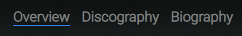
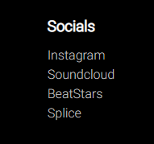

 

**Features in overview.html**
| **Feature** | **Action** | **Expected Result** | **Actual Result** |
|-------------|------------|---------------------|-------------------|
| Images | Clickable images to bring user to album/singles depending on which image clicked | Open new tab for album/single | Works as expected |
| Link | Anchor element to "Karlskoga, Sweden" | Bring user to Karlskoga, Sweden on Google Maps | Works as expected |

Images

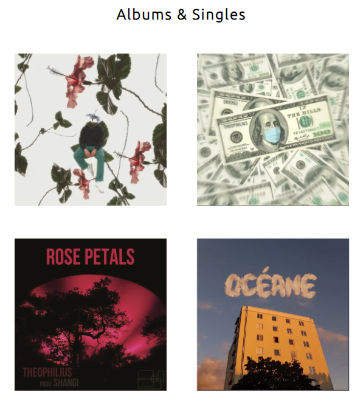
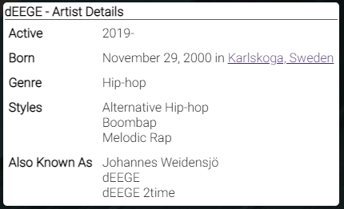

 

**Features in discography.html**
| **Feature** | **Action** | **Expected Result** | **Actual Result** |
|-------------|------------|---------------------|-------------------|
| Audio | Audio with controls, no autoplay | All audio muted when entering site, controls to audio | Works as expected |

Images

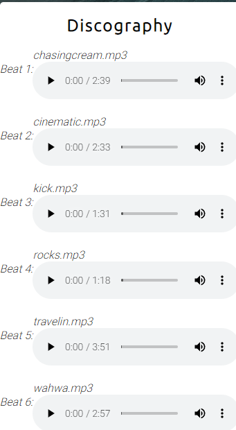

 

**Features in biography.html**
| **Feature** | **Action** | **Expected Result** | **Actual Result** |
|-------------|------------|---------------------|-------------------|
| Link | Anchor element to "Karlskoga Folkhögskola" | Brings user to school website in a new tab | Works as expected |

Images

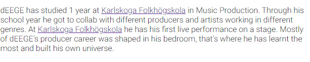

 

Unfixed Bugs

You will need to mention unfixed bugs and why they were not fixed. This section should include shortcomings of the frameworks or technologies used. Although time can be a big variable to consider, paucity of time and difficulty understanding implementation is not a valid reason to leave bugs unfixed.
Deployment

This section should describe the process you went through to deploy the project to a hosting platform (e.g. GitHub)

    The site was deployed to GitHub pages. The steps to deploy are as follows:
        In the GitHub repository, navigate to the Settings tab
        From the source section drop-down menu, select the Master Branch
        Once the master branch has been selected, the page will be automatically refreshed with a detailed ribbon display to indicate the successful deployment.

The live link can be found here - https://code-institute-org.github.io/love-running-2.0/index.html
Credits

In this section you need to reference where you got your content, media and extra help from. It is common practice to use code from other repositories and tutorials, however, it is important to be very specific about these sources to avoid plagiarism.

You can break the credits section up into Content and Media, depending on what you have included in your project.
Content

    The text for the Home page was taken from Wikipedia Article A
    Instructions on how to implement form validation on the Sign Up page was taken from Specific YouTube Tutorial
    The icons in the footer were taken from Font Awesome

Media

    The photos used on the home and sign up page are from This Open Source site
    The images used for the gallery page were taken from this other open source site

Congratulations on completing your Readme, you have made another big stride in the direction of being a developer!