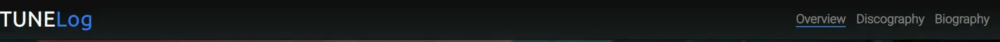
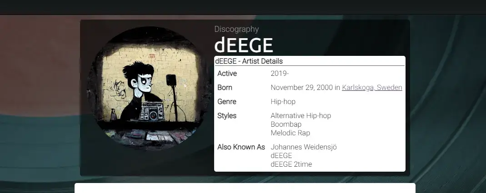
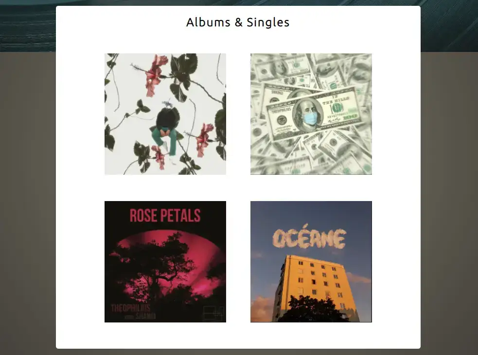
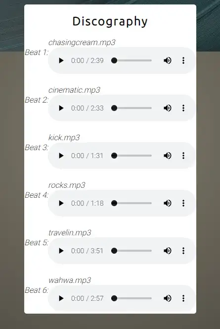
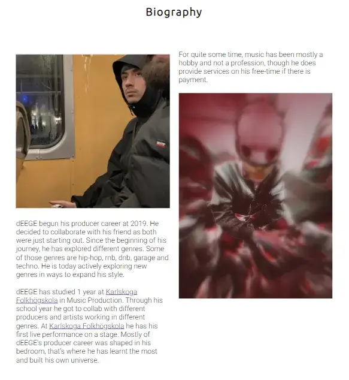

# Tune Log

Tune Log is designed to show a discography and a biography of my producer career as dEEGE. Here you will be able to get a sense of my style and where it comes from. You will learn how long I've been doing music and my passion for it, as well as the future of dEEGE. The main target of audience would be artists looking for beats to record vocals on, or other producers for inspiration or potential future collaborations. View the live website [here]()

## Features

### Overview
* Navigation bar
    * Logo also as a link directly to the home page.
    * Links to Overview, Discography and Biography pages.
    * Same features on all three pages, also shows which page is active.
    * Fully responsive on all devices.

* Landing Page
    * Landing page consists of an avatar of dEEGE.
    * Here the user will get some useful information thanks to the "Artist Details" box.
    * With the help of the chosen background image and also the box containing information, the user will immediately know what the website is about.
    * Same features on 2/3 pages (Overview & Discography pages)

* Albums and Singles(Overview) section
    * The website will display clickable images which links to albums and singles that I've collaborated on.
    * Allows the user the first glimpse of my style producing hip-hop.
    * Some minor animations when hovering over image.

 

* Footer
    * Here you will find links to dEEGE's social media and music related websites (Splice & Soundcloud).
    * When hovering over anchors, color change will happen with a slight 0.3s transition.
    * Same features on all three pages.

### Discography

* Discography Page
    * A showcase of beats to define the style of beats to the user.
    * Here are 6 available beats with controls and no autoplay.

### Biography

* Biography Page
    * Biography about dEEGE.
    * Contains information about his music and school career.

### Existing Features

* Responsive design
* 6 beats with controls
* Links to Album / Singles with animation (translateY())
* Links to social media

### Future Features

* Display album/single name in center when hovering over albums/singles
* Customize controls for .mp3 files.

## Design

### Wireframes

## Technologies

* HTML
    * Core content and structure written using HTML.

* CSS
    * Styling and responsive design written using CSS.

* Github
    * Source code hosted on github and deployed through github pages.

* Git
    * Commit and pushing code using git

* Cloudconvert
    * Used https://cloudconvert.com/png-to-webp to convert images to webp.

* Tinypng
    * Used https://tinypng.com/ to compress webp images.

* CSS Gradient
    * Used https://cssgradient.io/ to add gradient to background-color.

Testing

In this section, you need to convince the assessor that you have conducted enough testing to legitimately believe that the site works well. Essentially, in this part you will want to go over all of your project’s features and ensure that they all work as intended, with the project providing an easy and straightforward way for the users to achieve their goals.

In addition, you should mention in this section how your project looks and works on different browsers and screen sizes.

You should also mention in this section any interesting bugs or problems you discovered during your testing, even if you haven't addressed them yet.

If this section grows too long, you may want to split it off into a separate file and link to it from here.
Validator Testing

    HTML
        No errors were returned when passing through the official W3C validator
    CSS
        No errors were found when passing through the official (Jigsaw) validator

Unfixed Bugs

You will need to mention unfixed bugs and why they were not fixed. This section should include shortcomings of the frameworks or technologies used. Although time can be a big variable to consider, paucity of time and difficulty understanding implementation is not a valid reason to leave bugs unfixed.
Deployment

This section should describe the process you went through to deploy the project to a hosting platform (e.g. GitHub)

    The site was deployed to GitHub pages. The steps to deploy are as follows:
        In the GitHub repository, navigate to the Settings tab
        From the source section drop-down menu, select the Master Branch
        Once the master branch has been selected, the page will be automatically refreshed with a detailed ribbon display to indicate the successful deployment.

The live link can be found here - https://code-institute-org.github.io/love-running-2.0/index.html
Credits

In this section you need to reference where you got your content, media and extra help from. It is common practice to use code from other repositories and tutorials, however, it is important to be very specific about these sources to avoid plagiarism.

You can break the credits section up into Content and Media, depending on what you have included in your project.
Content

    The text for the Home page was taken from Wikipedia Article A
    Instructions on how to implement form validation on the Sign Up page was taken from Specific YouTube Tutorial
    The icons in the footer were taken from Font Awesome

Media

    The photos used on the home and sign up page are from This Open Source site
    The images used for the gallery page were taken from this other open source site

Congratulations on completing your Readme, you have made another big stride in the direction of being a developer!