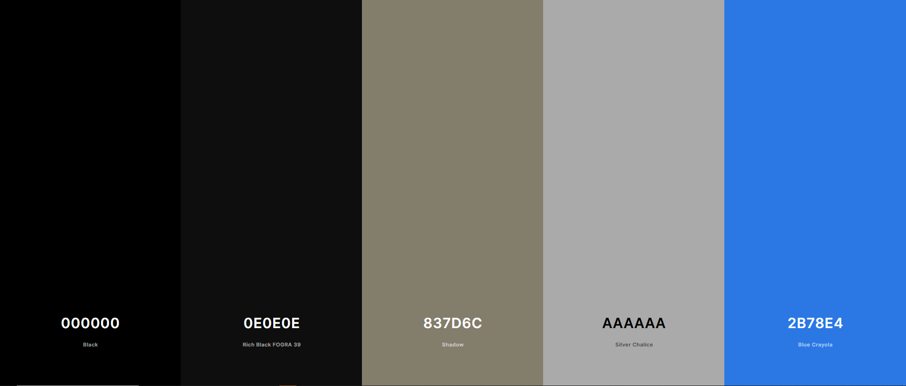
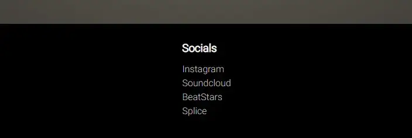
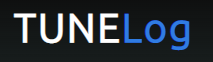

# Tune Log

Tune Log is designed to show a discography and a biography of my producer career as dEEGE. Here you will be able to get a sense of my style and where it comes from. You will learn how long I've been doing music and my passion for it, as well as the future of dEEGE. The main target of audience would be artists looking for beats to record vocals on, or other producers for inspiration or potential future collaborations. View the live website [here](https://deege2time.github.io/project1/).

## Table of Contents

1. [Features](#features)
    1. [Discography](#discography)
    2. [Biography](#biography)
    3. [Existing Features](#existing-features)
    4. [Future Features](#future-features)
2. [Technologies](#technologies)
    1. [Languages](#languages)
    2. [Tools](#tools)
3. [Testing](#testing)
    1. [Validation-HTML](#validation-html)
    2. [Validation-CSS](#validation-css)
    3. [Accessibility](#accessibility)
    4. [Performance](#performance)
    5. [Responsive Design](#responsive-design)
    6. [Browser Compatibility](#browser-compatibility)
    7. [Functional Testing](#functional-testing)
    8. [Unfixed Bugs](#unfixed-bugs)
4. [Deployment](#deployment)
    1. [Deploying through github pages](#deploying-through-github-pages)
    2. [Fork other repositories](#fork-other-repositories)
    3. [Clone other repositories](#clone-other-repositories)
5. [Credits](#credits)
    1. [Content](#content)
    2. [Media](#media)

## **Design**

### **Design choice**

Designed to look minimalistic, use of personal images to give the user a vibe of the owner.
 

### **Colors**

Chose a color combination of black-beige-blue with different shades of them. Blue is the overall theme here with background colors in beige and black.

 

### **Fonts**
Chosen fonts are simple and minimalistic to fit website theme.
* [Ubuntu (Headings)](https://fonts.google.com/specimen/Ubuntu?query=ubuntu)
* [Roboto (Body)](https://fonts.google.com/specimen/Roboto)

## **Features**

* Navigation bar
    * Logo also as a link directly to the home page.
    * Links to Overview, Discography and Biography pages.
    * Same features on all three pages, also shows which page is active.
    * Fully responsive on all devices.

* Landing Page
    * Landing page consists of an avatar of dEEGE.
    * Here the user will get some useful information thanks to the "Artist Details" box.
    * With the help of the chosen background image and also the box containing information, the user will immediately know what the website is about.
    * Same features on 2/3 pages (Overview & Discography pages)

* Albums and Singles(Overview) section
    * The website will display clickable images which links to albums and singles that I've collaborated on.
    * Allows the user the first glimpse of my style producing hip-hop.
    * Some minor animations when hovering over image.

 

* Footer
    * Here you will find links to dEEGE's social media and music related websites (Splice & Soundcloud).
    * When hovering over anchors, color change will happen with a slight 0.3s transition.
    * Same features on all three pages.

### **Discography**
 

* Discography Page
    * A showcase of beats to define the style of beats to the user.
    * Here are 6 available beats with controls and no autoplay.

### **Biography**
 

* Biography Page
    * Biography about dEEGE.
    * Contains information about his music and school career.

### **Existing Features**
 

* Responsive design
* 6 beats with controls
* Links to Album / Singles with animation (translateY())
* Links to social media

### **Future Features**
 

* Display album/single name in center when hovering over albums/singles
* Customize controls for .mp3 files.

## **Technologies**

### **Languages**
 

* HTML
    * Core content and structure written using HTML.

* CSS
    * Styling and responsive design written using CSS.

### **Tools**
 

* Github
    * Source code hosted on github and deployed through github pages.

* Git
    * Commit and pushing code using git

* Cloudconvert
    * Used https://cloudconvert.com/png-to-webp to convert images to webp.

* Tinypng
    * Used https://tinypng.com/ to compress webp images.

* CSS Gradient
    * Used https://cssgradient.io/ to add gradient to background-color.

* Favicon
    * Used https://favicon.io/favicon-generator/ to generate icon in head.

## **Testing**

### **Validation-HTML**
Used the W3C Markup Validation Service with urls. All pages passed with 0 errors.

Overview

Discography

Biography

 

### **Validation-CSS**
Used the W3C CSS Validation Service with url and stylesheet. All pages passed with 0 errors.

Whole project

Stylesheet

**Warning message: "Imported style sheets are not checked in direct input and file upload modes". From imported fonts** 

 

### **Accessibility**
Ran through WAVE, web accessibility evaluation tool. All pages passed with 0 errors.

Overview

Discography

Biography

 

### **Performance**
Ran through Google Lighthouse via Google Devtools, only biography scored 99 whilst overview scored 72 and discography scored 75.

Overview

Discography

Biography

 

### **Responsive Design**
 

Tested for all devices 320px and up.
* Test results from Google Devtools

### **Browser Compatibility**
 

Test from following browsers without problems
* Google Chrome
* Firefox
* Safari (iPhone)

### **Functional Testing**
 

**Basic features displayed through all three pages.**
| **Feature** | **Action** | **Expected Result** | **Actual Result** |
|-------------|------------|---------------------|-------------------|
| Logo | Link to overview | Bring user to overview(home page) | Works as expected |
| Navigation | Navigation for overview, discography, biography| Allow user to navigate through site and show active page | Works as expected |
| Footer | Links to different websites where they can follow artist | Transferred to a new page in new tab | Works as expected |

Images

 

**Features in overview.html**
| **Feature** | **Action** | **Expected Result** | **Actual Result** |
|-------------|------------|---------------------|-------------------|
| Images | Clickable images to bring user to album/singles depending on which image clicked | Open new tab for album/single | Works as expected |
| Link | Anchor element to "Karlskoga, Sweden" | Bring user to Karlskoga, Sweden on Google Maps | Works as expected |

Images

 

**Features in discography.html**
| **Feature** | **Action** | **Expected Result** | **Actual Result** |
|-------------|------------|---------------------|-------------------|
| Audio | Audio with controls, no autoplay | All audio muted when entering site, controls to audio | Works as expected |

Images

 

**Features in biography.html**
| **Feature** | **Action** | **Expected Result** | **Actual Result** |
|-------------|------------|---------------------|-------------------|
| Link | Anchor element to "Karlskoga Folkhögskola" | Brings user to school website in a new tab | Works as expected |

Images

 

### **Unfixed Bugs**
 
Bugs to be fixed in the future as I did not have time.
* Regarding website responsiveness, the content starts to slightly move to the left below 330px.
 

## **Deployment**

The website was deployed through the use of GitHub Pages, a feature built in to GitHub.

### **Deploying through github pages**
1. In your repository, click on "Settings" from the top of the menu.
2. In the side menu to your left, click "Pages" in "Code and automation" section.
3. Set "Source" to "Deploy from branch".
4. Set desired branch and set director to /(root).
5. Click "Save" and wait for github to display your URL at the top of this page.
 

### **Fork other repositories**
1. Go to desired repository.
2. Click "Fork" in the upper-right corner.
3. Select owner, set repository name and add description(optional).
4. Choose to copy default or all branches.
5. Click "Create Form".
 

### **Clone other repositories**
1. In your selected repository, click "Code" drop down button.
2. Select desired cloning method (HTTP)
3. Copy repository to clipboard
4. Open IDE of choice.
5. Type "git clone copied-git-url" into the IDE terminal. (Need git installed) 
 

## **Credits**

* Animation
    * Used a combination of these two to create hovering psuedo class animations with CSS.
        * [Transform](https://www.w3schools.com/cssref/css3_pr_transform.php)
        * [Transition](https://www.w3schools.com/css/css3_transitions.asp)

* [Flexbox](https://www.w3schools.com/css/css3_flexbox.asp)
    * Used to create the structure of the website.

* [Gradient](https://cssgradient.io/)
    * Used this generator to create desired color gradients.
 

### **Content**

All content except vinyl image on landing page is owned by dEEGE.
 

### **Media**

Landing page background image of a vinyl was grabbed from [Pexels](https://www.pexels.com/photo/blue-vinyl-record-playing-on-turntable-1389429/).

All audio files are owned by me.